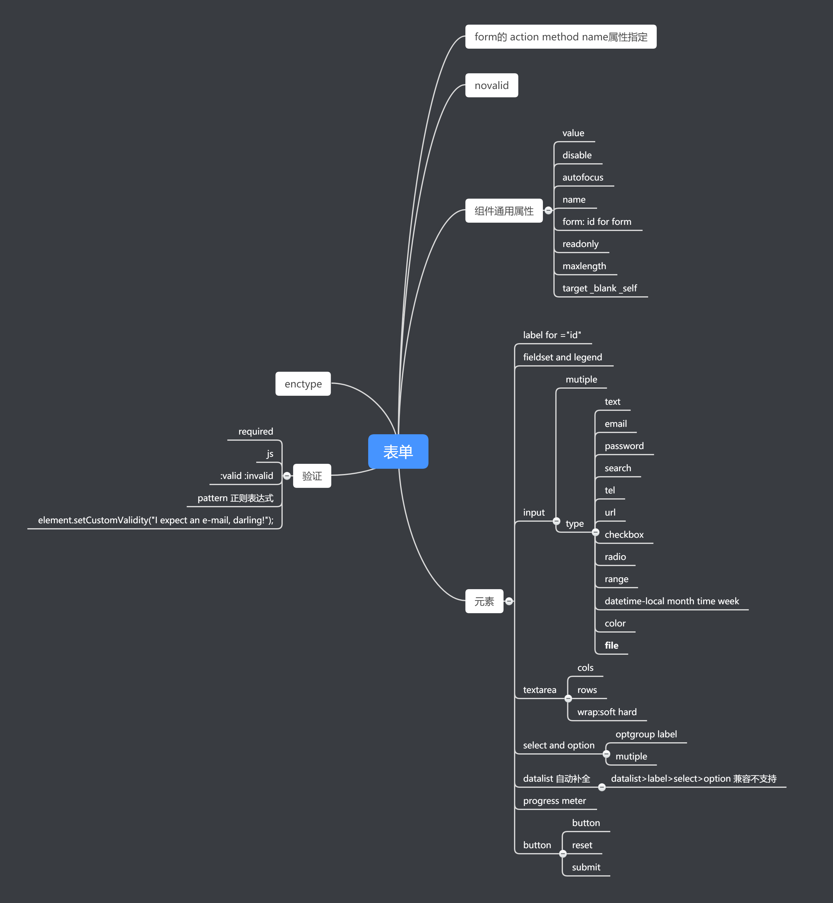

# 从〇开始的HTML搬砖

## 7.06 

8:00a.m.-6:00p.m.  一直在机房实训搬砖，emmm [Github](https://github.com/VincentCung) 为证

7:30p.m. - - 在看 W3C的规范 [参考链接1](https://www.w3.org/TR/2017/REC-html52-20171214/introduction.html)  

> **超文本标记语言 (HTML) **是 Web 内容的核心语言。HTML 语言描述了 Web 文档内容的结构和语义。
>
> **HTML** was primarily designed as a language for semantically describing scientific documents

体验：W3C的官方HTML5.2 文档除了常用的标签 也介绍了很多网络，浏览器的知识，实在晦涩难懂，于是只能选择性优先阅读能读的懂的部分

### 知识点

1. secure application

   - Not validating user input Cross-site scripting (XSS) SQL injection，

     需要对用户的输入进行有效验证，防止跨域的脚本注入，而导致安全问题的发生

   - CSRF 

     用户发送请求时必须验证请求是否由用户故意，而不是通过另一个网站欺骗用户在不知不觉中发出请求；原因：HTML表单可以提交到其他origin

   - clickJack

     需要设计向用户提供用于执行用户可能不希望执行的动作的界面的页面，以避免用户被欺骗激活界面的可能性，简单来说就是提供**取消**的选项给用户。

2. common pitfalls to avoid when using the script APIs

   深入理解HTML执行顺序，避免脚本执行时的错误

3. comformance requirements

   - Presentational Markup 的废除，用style标签或属性取代实现标签的展示；原因：维护成本高，文档冗余，降低访问性能

   - 语法错误的限制 [具体各类错误的展示](https://www.w3.org/TR/2017/REC-html52-20171214/introduction.html#syntax-errors)

     - 一个错误的代码块

     ```html
     <a href="?bill&ted">Bill and Ted</a> <!-- &ted is ok, since it’s not a named character reference -->
     <a href="?art&amp;copy">Art and Copy</a> <!-- the & has to be escaped, since &copy is a named character reference -->
     ```


   - 内容模型和属性值的限制：

4. Document metadata

   - what's in the head?

     - title 页标签名 document.title

     - base (herf target) 文档基地址

     - link 链接到其他资源 常见属性：href，rel，type，title，media，herflang

     - meta 页面的元数据 name/http-equiv/charset 必须有一个 且有content对应

       - name与content 元数据的键值对  

         - author/description/keywords 便于搜索引擎

         - 自定义的元数据协议 

           ```html
           <meta name="twitter:title" content="Mozilla Developer Network">
           <!-- this is a custom metadata protocol-->

           ```

         - 定义文档特定视口特征

         ```html
         <meta content="width=device-width, initial-scale=1, shrink-to-fit=no,maximum-scale=1.0" name="viewport">
         <!-- this is a custom metadata usage in moblie-->
         ```

         - [...](https://www.w3.org/TR/2017/REC-html52-20171214/document-metadata.html#standard-metadata-names)

       - http-equiv

       - charset 基本都是utf-8

       - property

     - style

另一个[参考连接2](https://developer.mozilla.org/zh-CN/docs/Learn/HTML/Introduction_to_HTML/The_head_metadata_in_HTML) 是MDN


## 7.07

8:00a.m.-6:00p.m. 照旧机房搬砖 

有保证的代码量，可是还是希望做一些偏h5 css3基础的demo测试

7:30p.m. - 9:30p.m. 在启明办公室 补全HTML。。参考 [MDN](https://developer.mozilla.org/zh-CN/docs/Learn/HTML/Introduction_to_HTML/The_head_metadata_in_HTML) 

刚准备睡，打开电脑想要pr，发现，文档没有保存...............  

文档是第二天早上再写的...


---

### 知识点

1. Content categories

   每一个HTML元素根据所包含内容的不同来进行分类， 并归类为几个常见的元素内容模型（content model），具体分类图如下，有的元素可能同时属于一个或多个content model

   

   - 常见不同分类标签

     - metadata:base,link,meta,noscript,script,style,template,title 一般不在文档主内容中显示展示

     - flow : a,abbr, article,audio,div,img,input,ul 位于文档body中的元素 基本均属于这一类

     - **sectioning content**: article aside,nav, section 用于定义文档结构，在当前的大纲中创建一个section，此分节将定义\<header\>元素、\<footer\>元素和标题元素（heading content）的范围。

     - heading：h1~h6 hgroup

     - phrasing :规定文本和它包含的标记,使包含内容变成段落

     - Embedded:audio,canvas,embed,iframe,img,math,object,svg,video输入另一个资源插入文档

     - Interactive:a,button,iframe,keygen,label,select,textarea 交互元素 

     - palpable  content

       在没有隐藏或非空的前提时，内容就是可感知的，那么他就会被渲染并客观存在，如果一个元素的模型是flow或者phasing 的那么它必须需要至少一个节点可感知

       > Content is palpable when it's neither empty nor hidden; it is content that is rendered and is substantive. Elements whose model is flow content or phrasing content should have at least one node which is palpable.

     - 表单相关

       - listed:button fieldset input select textarea
       - labelable: button input select textarea
       - submittable button input select
       - resettable input output select textarea

     - Secondary categories

     - Script-supporting elements:script template

     - transparent content model:del ins

2. H5的文档与分段  [参考](https://developer.mozilla.org/zh-CN/docs/Web/Guide/HTML/Sections_and_Outlines_of_an_HTML5_document) 

   H5通过加入了sectioning content的模型，使得文档生成的结构更为合理与有效。


>HTML 4 的文档结构定义和其隐含的大纲算法**非常粗糙**而且造成了很多问题：
>
>1.  定义语义性章节的`div`元素的用法,如果没有为class属性赋以特殊的值，使生成自动生成大纲的算法变得不可能 ("一个div元素是不是大纲的一部分, 定义的是章节还是子章节?" 或者 "该div元素是仅仅为了样式化?")。换句话说, HTML4规范在章节的定义和章节的范围都不精确。 自动生成大纲是重要的,尤其是在倾向于通过根据文档大纲内容去展示内容的辅助技术（ assistive technology）。 HTML5 在自动生成大纲算法的过程中去掉了div元素，并新增了一个元素，`section`元素。
>2.  合并多个文档是困难的：主文档中包含子文档意味着改变HTML标题元素的级别，以使得文档大纲能够保持下来。 这个已经被HTML5的新的章节元素解决了，因为新引入的元素(就是sectioning那几个) 总是距离其最近的祖先章节的子章节, 与子文档章节内部的标题没有关系.
>3.  HTML4中，**所有的章节**都是文档大纲中的一部分。但是文档并不总是这样。文档可以包含那些不是大纲的特殊章节, 但是与文档有关的, 就像广告块和解释区域。 HTML5 引入aside元素使得这样的节点不会插入到主纲要中。 
>4.  另外, 因为在 HTML4中任何的部分都是文档大纲的一部分, 没有办法产生与网站相关而不是与文档相关的节段，比如logos,menus,目录或版权信息和法律声明。为了这个目的, HTML5 引入了三个特殊的节段 元素： 包含链接集合的`nav`元素, 例如目录, 包含网站相关信息的`footer`元素和`header`元素 。
>
>更具有普遍意义的是HTML5使得章节和标题特性更精确。使得文档大纲变的可预测，浏览器使用后也可以提高用户体验。


- H5的大纲算法

  `body`元素中的所有内容都是节段中的一部分。节段在HTML5中是可以嵌套的。`body`元素定义了主节段，基于主节段，可以显式或隐式定义各个子节段的划分。显式定义的节段则是由sectioning content model所标记的内容

- HTML5引入了2个新的元素`aside`,`nav`，用来定义那些不属于web文档主要大纲中的节段，也引入了两个可以用于标记节段的页眉和页脚的新元素。`header`&`footer`

- 分节元素中的地址和发表时间

  文档中来自其他作者的节段 需要用`article`来定义 经H5拓展的`address`元素能够链接到最近的`body`或者`article `  新增加的`time`元素用来表示发表时间 同理

- 一个让不支持H5的浏览器 支持sectioning content model的代码块

  ```html
  <!--[if lt IE 9]>
    <script>
      document.createElement("header" );
      document.createElement("footer" );
      document.createElement("section"); 
      document.createElement("aside"  );
      document.createElement("nav"    );
      document.createElement("article"); 
      document.createElement("hgroup" ); 
      document.createElement("time"   );
    </script>
    <noscript>
       <strong>Warning !</strong>
       Because your browser does not support HTML5, some elements are simulated using JScript.
       Unfortunately your browser has disabled scripting. Please enable it in order to display this page.
    </noscript>
  <![endif]-->
  ```


## 7.09 

8:00a.m. -12:00 a.m. 机房搬砖 基本完成

2:30 p.m. -  冰岩办公室 开始 继续补全HTML的基础 开始看[《HTML5与CSS3权威指南（上册）》](https://book.douban.com/subject/26644632/) 把握基础才是关键


### 知识点

1. 可编辑得HTML元素 为元素添加contentediable = true的属性即可编辑元素

   calling `execCommand()` will affect the currently active editable element.

2. 数据属性 data-* 

   - js 中的访问：document.querySelector().dataset.*;
   - css中的访问 : content: attr(data-parent);
   - IE10或以下 必须用getAttribute() 
   - dataset的行为 比getAttribute慢

3. HTML表单分类

   