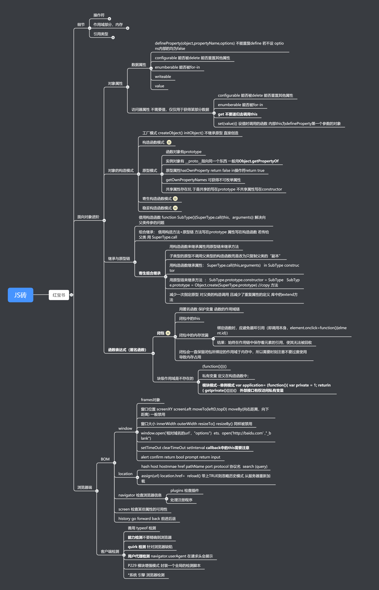
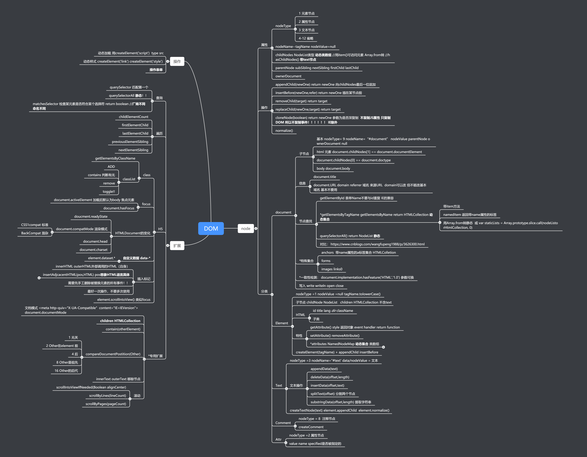

# 工地中的红宝石-JS高级程序设计




 ## 7.16 

今天主要在第六章第七章 关于原型链继承闭包的部分看了特别久也理解了特别久，今天重新了解到闭包的定义，然后原型链用来继承的骚操作--**寄生组合继承**，顺便我想问问这个东西日常开发中真的会用到吗，还是用一些util类库的extend方法？

然后也看到了模块模式中的单例模式，想问一下开发中的实际用处？一般哪些类会用到？

计划明天继续阅读完dom 跟xhr部分的JS红包书（DOM部分估计记忆部分为主，理解会少点所以看的比较快）

然后尝试看看麦冬去年夏令营重构小米官网的任务


## 7.17

 

今天阅读了一下DOM部分，跟XHR的部分，然后大概弄了下小米官网的结构 

也看了一下跨域的解决方案（目前还不理解也没有实践过，明天继续完善笔记）

> 提问: 所谓跨域是指在本站请求别的域名内的东西，那么，通过fly或axios 或者 fetch 等等，把发送的url直接设成别人的url 例如 

```javascript
axios.get('http://api01.bitspaceman.com:8000/book/douban?apikey=<您自己的apikey> ') //假设使用豆瓣api
  .then(res=>{
  	//data process
})
```

>这种算是跨域吗？ 还是跨域的概念有点不太懂，如果直接这样用就可以用就不必要记那么多所谓跨域的方案了


具体常见的方案就是

1. JSONP 通过动态生成script标签去请求数据，缺点是发不了POST

2. 空iframe配合form的submit方法 

3. CORS 后端需要配置中间件 前端也要带上相应header触发非简单请求

4. 代理 NGINX

5. postMessage 这个我有点疑惑，需要同时打开两个页面才能去实现跨域，不是会对用户很不友好吗？？


