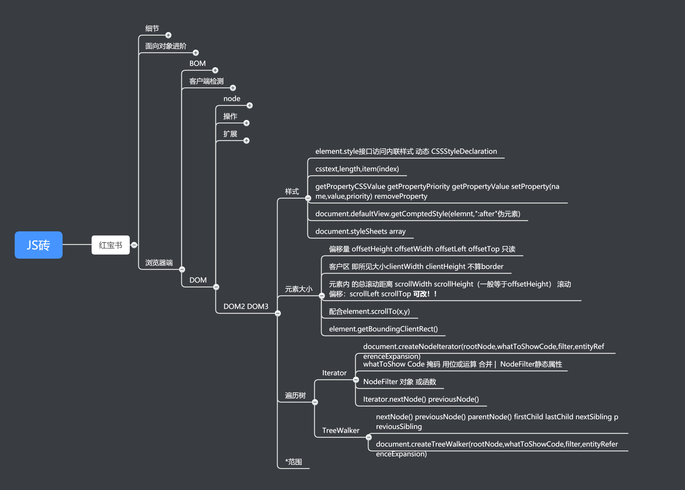

# 工地中的红宝石-JS高级程序设计


 ## 7.16 

今天主要在第六章第七章 关于原型链继承闭包的部分看了特别久也理解了特别久，今天重新了解到闭包的定义，然后原型链用来继承的骚操作--**寄生组合继承**，顺便我想问问这个东西日常开发中真的会用到吗，还是用一些util类库的extend方法？

然后也看到了模块模式中的单例模式，想问一下开发中的实际用处？一般哪些类会用到？

计划明天继续阅读完dom 跟xhr部分的JS红包书（DOM部分估计记忆部分为主，理解会少点所以看的比较快）

然后尝试看看麦冬去年夏令营重构小米官网的任务


## 7.17

 

今天阅读了一下DOM部分，跟XHR的部分，然后大概弄了下小米官网的结构 

也看了一下跨域的解决方案（目前还不理解也没有实践过，明天继续完善笔记）

> 提问: 所谓跨域是指在本站请求别的域名内的东西，那么，通过fly或axios 或者 fetch 等等，把发送的url直接设成别人的url 例如 

```javascript
axios.get('http://api01.bitspaceman.com:8000/book/douban?apikey=<您自己的apikey> ') //假设使用豆瓣api
  .then(res=>{
  	//data process
})
```

>这种算是跨域吗？ 还是跨域的概念有点不太懂，如果直接这样用就可以用就不必要记那么多所谓跨域的方案了


具体常见的方案就是

1. JSONP 通过动态生成script标签去请求数据，缺点是发不了POST

2. 空iframe配合form的submit方法 

3. CORS 后端需要配置中间件 前端也要带上相应header触发非简单请求

4. 代理 NGINX

5. postMessage 这个我有点疑惑，需要同时打开两个页面才能去实现跨域，不是会对用户很不友好吗？？


## 7.18 




今天细看了一下跨域的各种方案，大概有了一定的认识是这样的：

1. 具体选择哪种方案的跨域，是取决于别人服务器提供的API用的是哪一种方案：例如百度关键词/豆瓣 用的是JSONP 具体发请求的话 可以用JSONP的包或者原生自己封装

2. CORS 的话 一般用于不向外公布的api 然后需要前端配置请求的header

3. 不过讲道理最后的解决方案其实都是用后台直接请求别人的数据，不通过浏览器发东西根本就没有这个跨域的问题，又或者用nginx 代理到别的域名上面

4. 然后用axios和dev-server的时候，看见网上说可以配置proxyTable 去直接跨域请求别人的api 试了一下是可行的，但是我不知道这种做法的应用场景在哪，望指出

5. **最后，以上我有什么理解错，希望提出建议**

   晚上稍稍写了mi.com的头 明天估计能把交互以外的写完。然后感觉最近几天因为都在看书为主，文字产出率奇低，想问一下有没有那种典型交互效果的方案源码的学习资料（比如就是轮播图，下拉菜单这种），因为实在太多方法可以实现同一个效果，网上如果搜的话实现代码水平参差不齐，有没有比较好的方案跟代码去学习。现在都是偶尔codePen看一下比较新的效果，一些比较传统的效果不知道怎么学。

## 7.19

EMMM，实在担心怕最后验收没有东西展示，先开始做demo了，红书的阅读也可能会搁置，可能会跳着章节继续读，想问下红书里面有挺多篇幅是关于XHTML的，但是感觉实际操作中又很少用得到，这部分的章节需要阅读吗？然后计划是开始去写麦冬上一年夏令营的主任务，估计是闭营写不完的，尽可能完善基本的。然后还是昨晚的问题，有没有一些传统交互的学习资源，搜索引擎找到的代码真的水平参差不齐。


## 7.20

摸了一天的鱼，今天终于找到锅了，唐友枫给布置了博客后台的任务编写，前端还有交互部署什么的留到暑假自己回去写，（其实我也挺愿意自己写一个完整的博客，估计闭营后会用vue继续搭前端跟最后尝试部署一下），红书决定恢复阅读但是每天只要1-2章的阅读量即可，重心放在那个后台